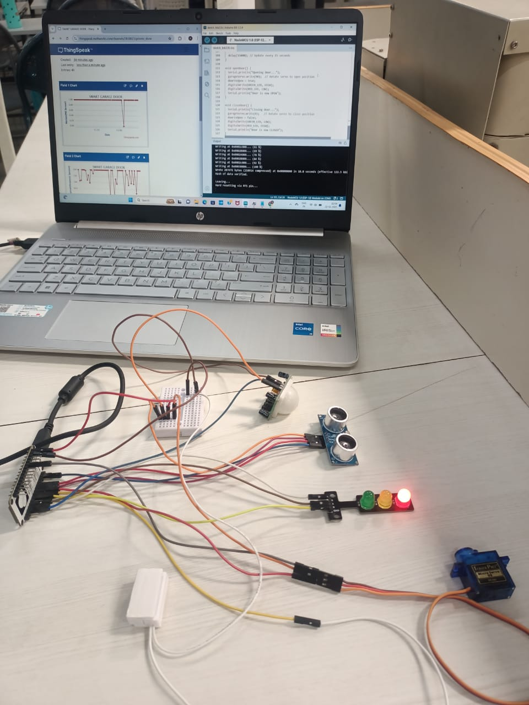
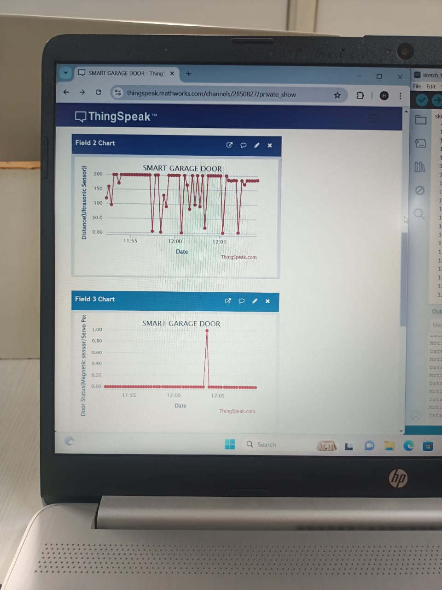
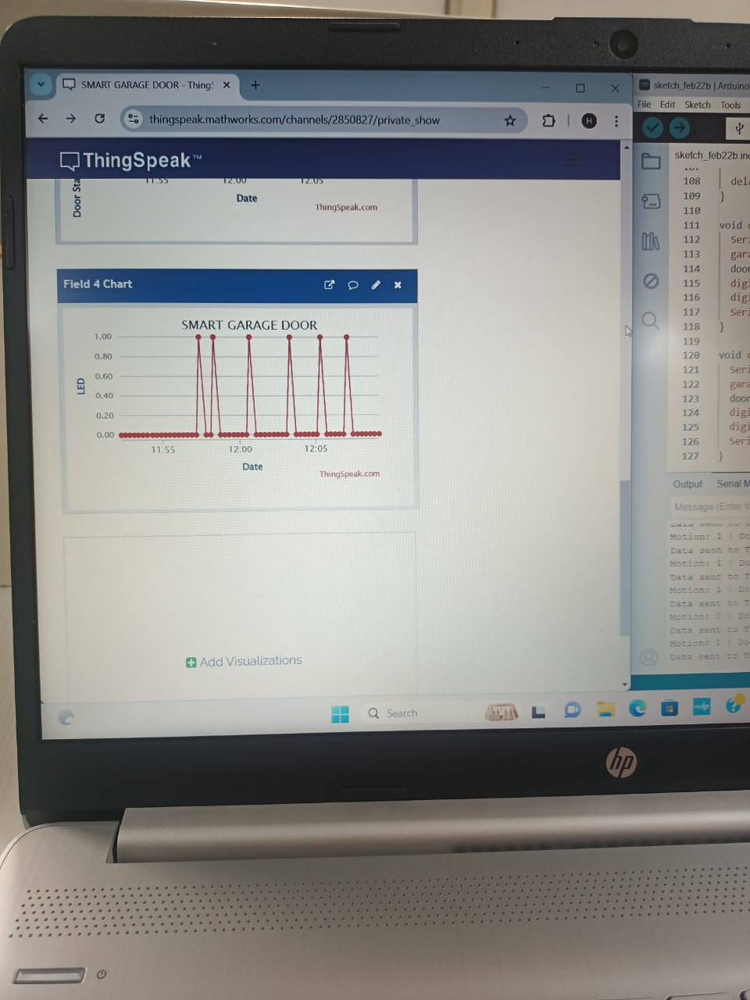

# Smart Garage Door Monitoring and Control System

This project is a smart garage door automation and monitoring system built using the NodeMCU ESP8266. It detects motion using a PIR sensor, checks for object presence with an ultrasonic sensor, and monitors door status with a magnetic sensor. The system opens the door automatically when a vehicle is detected and sends real-time data to ThingSpeak for remote monitoring.

## Developed By

**Gayathri G**  
GitHub: [@GAYATHRI1006](https://github.com/GAYATHRI1006)

## Screenshot

## Features

-  Motion detection via PIR sensor
-  Object detection using Ultrasonic sensor
-  Door status monitoring with magnetic reed switch
-  Automatic door opening and closing using a Servo motor
-  LED indicators for door status (open/closed)
-  Wi-Fi connectivity (ESP8266)
-  Real-time data updates to [ThingSpeak](https://thingspeak.com/)
-  Failsafe distance detection to prevent unwanted triggers

##  Hardware Components

| Component             | Description                       |
|----------------------|-----------------------------------|
| NodeMCU ESP8266      | Wi-Fi microcontroller              |
| SG90 Servo Motor     | For opening and closing the door   |
| PIR Motion Sensor    | Detects human/vehicle presence     |
| Ultrasonic Sensor    | Measures distance to the garage    |
| Magnetic Reed Switch | Detects door open/close status     |
| LEDs (Red/Green)     | Indicates door status              |
| Power Supply         | 5V USB or Battery                  |

## Pin Configuration

| Pin        | Connected To              |
|------------|---------------------------|
| D2         | PIR Sensor Output         |
| D3         | Green LED (Door Open)     |
| D4         | Red LED (Door Closed)     |
| D5         | Magnetic Reed Switch      |
| D6         | Servo Motor (Signal Pin)  |
| D7         | Ultrasonic Sensor Trigger |
| D8         | Ultrasonic Sensor Echo    |

## Working Logic

- When **motion is detected** and **vehicle is nearby** (distance < 50cm) and the **door is currently closed**, the system opens the door using the servo motor.
- After a preset time (5 seconds) and no motion or vehicle detected, the door automatically closes.
- LEDs indicate the door status:
  - 🔴 Red = Door Closed
  - 🟢 Green = Door Open
- All sensor readings and status updates are sent to ThingSpeak every 15 seconds.
- - **Fields**:
  - Field 1: PIR Motion Sensor (1 = motion, 0 = no motion)
  - Field 2: Distance from Ultrasonic sensor (in cm)
  - Field 3: Magnetic Sensor (0 = closed, 1 = open)
  - Field 4: Door Status (1 = open, 0 = closed)

## How to Use

1. Upload the code to your NodeMCU using Arduino IDE.
2. Connect to Wi-Fi with the provided SSID and password.
3. View real-time data on your ThingSpeak channel.
4. The system will automatically handle door operation based on motion and distance detection.

